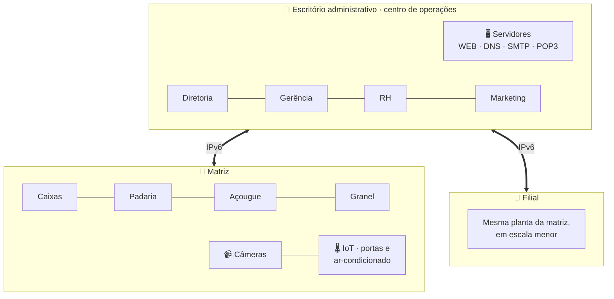

<a href="https://gotardon1.github.io/GotardoN1/#projeto/colina">
  <picture>
    <source media="(prefers-color-scheme: dark)" srcset="https://raw.githubusercontent.com/GotardoN1/GotardoN1/main/assets/projetos/colina-dark.svg">
    
  </picture>
</a>

**[Ver no portfólio interativo](https://gotardon1.github.io/GotardoN1/#projeto/colina)** · **[Perfil](https://github.com/GotardoN1)**

## Sobre

Planejamento e simulação da infraestrutura de rede completa de uma rede de supermercados fictícia, o **Supermercado Colina**, em Curitiba/PR. O objetivo foi juntar num cenário empresarial realista três assuntos: redes locais (LAN), interligação de unidades e Internet das Coisas (IoT).

## Topologia

## As três unidades

| Unidade | Papel |
|---|---|
| **Escritório administrativo** | Gestão, servidores e RH. Dividido em Diretoria, Gerência, RH e Marketing; gateway padrão `FE80::1` e núcleo de servidores WEB e DNS |
| **Matriz** | Unidade completa: atendimento, caixas, granel, padaria, açougue e monitoramento por câmeras |
| **Filial** | Menor e mais prática. Segue a planta da matriz, com equipamentos padronizados para facilitar a manutenção |

## Destaques técnicos

- **IPv6** com `unicast-routing` e endereços link-local (`FE80::1`).
- **Serviços de rede**: DNS, WEB, SMTP e POP3 para a comunicação interna e externa.
- **E-mail entre unidades** com servidores SMTP/POP3.
- **IoT**: portas automáticas e ar-condicionado controlados pela rede.
- **Hubs trocados por switches**, para gerenciar melhor os pacotes e suportar IPv6.
- **Segmentação por setor** no escritório, para mais organização e segurança.

## Neste repositório

| Arquivo | Conteúdo |
|---|---|
| [`cisco_pi_planta_2_em_21-09-2020_3_2_1.pkt`](cisco_pi_planta_2_em_21-09-2020_3_2_1.pkt) | Simulação da rede no Cisco Packet Tracer |
| [`PI_segundo_periodo_5.docx`](PI_segundo_periodo_5.docx) | Relatório completo, com os comandos de configuração |

## Como abrir

1. Baixe o arquivo `.pkt`.
2. Abra no **Cisco Packet Tracer** (recomendado: versão 8.x).
3. Para os comandos de configuração, consulte o relatório `.docx`.

## Autores

| | |
|---|---|
| **Cristian Yehudi Marques Ros** | **Fabrício Corrêa de Souza** |
| **Matheus Gonçalves Gotardo** | **Nicole Guerreiro Diniz** |

Centro Universitário Campos de Andrade (UNIANDRADE).

---

Mais projetos: <a href="https://github.com/GotardoN1/grafo-social">Grafo Social</a> · <a href="https://github.com/GotardoN1/jogo-repita-a-sequencia">Repita a Sequência</a> · <a href="https://gotardon1.github.io/GotardoN1/#projetos">todos no portfólio</a>

